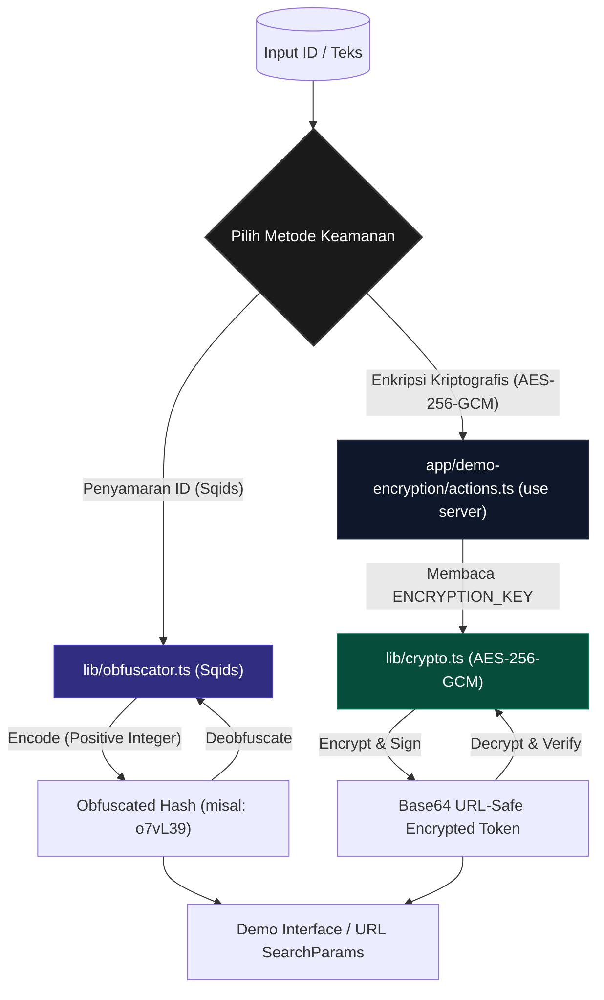

# 🚀 Init Next.js App — Amir App

Selamat datang di **Amir App**, template Next.js 16 modern berbasis **React 19**, **Tailwind CSS v4.3**, dan **TypeScript 6 (Strict Mode)** dengan dukungan Progressive Web App (PWA) serta integrasi i18n native berbasis cookie tanpa URL prefix.

Repositori ini dioptimalkan secara mendalam menggunakan **Bun** sebagai pengelola paket, konfigurasi **ESLint v9**, serta dilengkapi dengan **ID Security Suite** bawaan untuk pengamanan identitas data Anda.

---

## 📊 Arsitektur Pengamanan ID (ID Security Suite)

Berikut adalah visualisasi alur pemrosesan data pada dua fitur keamanan utama (Sqids & AES-256-GCM) yang terintegrasi di dalam template ini:



---

## ✨ Fitur Utama

1. **Next.js 16 (App Router)** & **React 19**: Memanfaatkan fitur rendering server terbaru (*Server Components by default*).
2. **Tailwind CSS v4.3 & Theming**: Styling modern berbasis CSS variables (`@theme inline`) dilengkapi `ThemeSwitcher` (`next-themes`) untuk Dark 🌙, Light ☀️, dan System 💻 mode.
3. **Serwist PWA v9.5**: Service worker luring (*offline-first*) yang tangguh untuk mendukung Progressive Web Application.
4. **Cookie-Based Native i18n**: Sistem lokalisasi native berbasis cookie `NEXT_LOCALE` tanpa prefix URL `[lang]`, menjaga URL tetap bersih (`/`, `/demo-encryption`). Mendukung Bahasa Indonesia (default: `id`) dan Inggris (`en`).
5. **ID Security Suite**:
   * **Sqids Obfuscation**: Mengubah ID integer database (auto-increment) menjadi hash unik ramah URL untuk menyembunyikan detail sensitif database.
   * **AES-256-GCM Cryptography**: Enkripsi dua arah terautentikasi (*tamper-proof*) berbasis server untuk menjaga privasi data sensitif seperti UUID atau string transaksi.
6. **Continuous Integration (CI)**: Pipeline GitHub Actions otomatis untuk mendeteksi error linter dan memverifikasi build aplikasi pada setiap Pull Request ke cabang `master`.

---

## 📁 Struktur Folder Utama

```
Init-nextjs-app/
├── .github/workflows/         # Pipeline CI GitHub Actions (Lint & Build)
├── src/                       # 📂 Semua Source Code Utama
│   ├── app/                   # Next.js App Router
│   │   ├── _components/       # Komponen UI App-wide (ThemeSwitcher, LanguageSwitcher)
│   │   ├── demo-encryption/   # Halaman & Komponen Demo Keamanan ID
│   │   │   ├── actions.ts     # Server Actions (use server)
│   │   │   ├── DemoClient.tsx # Komponen Interaktif Klien
│   │   │   └── page.tsx       # Halaman utama demo (Server Component)
│   │   ├── favicon.ico
│   │   ├── globals.css        # Pengaturan CSS & Tema Tailwind v4
│   │   ├── layout.tsx         # Root Layout (ThemeProvider, Metadata SEO)
│   │   ├── manifest.ts        # Web App Manifest PWA
│   │   ├── page.tsx           # Halaman Utama (Homepage i18n)
│   │   ├── providers.tsx      # Provider Wrapper (next-themes ThemeProvider)
│   │   ├── robots.ts          # Generator robots.txt
│   │   ├── sitemap.ts         # Generator sitemap.xml
│   │   └── sw.ts              # Service Worker (Serwist)
│   ├── dictionaries/          # Berkas Terjemahan Bahasa (JSON)
│   │   ├── id.json            # Bahasa Indonesia (Default)
│   │   └── en.json            # Bahasa Inggris
│   ├── i18n/                  # Konfigurasi i18n
│   │   └── config.ts          # Config locale & tipe Locale
│   ├── lib/                   # Utilitas Pendukung Server & Client
│   │   ├── crypto.ts          # Enkripsi & Dekripsi AES-256-GCM (Server-Only)
│   │   ├── dictionaries.ts    # Dictionary loader (Server-Only)
│   │   ├── i18n-actions.ts    # Server Action pengubah cookie NEXT_LOCALE
│   │   ├── i18n-server.ts     # Helper retrieval locale & dictionary (Server-Only)
│   │   ├── obfuscator.ts      # Penyamaran & Pemulihan ID (Sqids)
│   │   └── seo.ts             # Utilitas JSON-LD & SEO Metadata
│   └── proxy.ts               # Proxy middleware ringan
├── public/                    # Aset statis & Ikon PWA
├── prompt_ai/                 # Prompt AI & panduan instruksi
├── .env                       # Variabel environment umum
├── .env.development           # Overrides dev lokal
├── .env.production            # Overrides produksi (tanpa rahasia)
├── .env.example               # Template referensi variabel environment
├── AGENTS.md                  # Aturan khusus AI Agent (Next.js & Skills)
├── GUIDELINE.md               # 📌 Panduan arsitektur & standar coding proyek
├── next.config.ts             # Konfigurasi Next.js
├── tsconfig.json              # Konfigurasi TypeScript Strict
├── eslint.config.mjs          # Konfigurasi ESLint v9
└── package.json               # Dependensi & skrip proyek
```

---

## 🛠️ Panduan Pengembangan

### Prasyarat
Pastikan Anda telah memasang **Bun** (≥ 1.3) di sistem lokal Anda.

### 1. Pemasangan Dependensi
Pasang seluruh paket pustaka dengan cepat menggunakan Bun:
```bash
bun install
```

### 2. Jalankan Mode Pengembangan
Jalankan server lokal untuk melihat hasil perubahan secara langsung:
```bash
bun run dev
```
Buka [http://localhost:3000](http://localhost:3000) di peramban Anda.

### 3. Pemeriksaan Linter (ESLint)
Pastikan kode Anda bebas dari error linter sebelum melakukan komit:
```bash
bun run lint
```

### 4. Build untuk Produksi
Verifikasi kelayakan kompilasi proyek Next.js Anda:
```bash
bun run build
```

---

## 🌐 Panduan Penggunaan i18n (Internationalization)

Pengaturan bahasa menggunakan cookie `NEXT_LOCALE` tanpa mengubah URL path.

### Di Server Component:
```typescript
import { getCurrentDictionary } from "@/lib/i18n-server";

export default async function Page() {
  const { locale, dict } = await getCurrentDictionary();

  return <h1>{dict.home.title}</h1>;
}
```

### Di Client Component:
Gunakan komponen `LanguageSwitcher` dari `@/app/_components/language-switcher`:
```tsx
import { LanguageSwitcher } from "@/app/_components/language-switcher";

export function Header() {
  return <LanguageSwitcher />;
}
```

---

## 🔒 Panduan Penggunaan ID Security Suite

### 1. Penyamaran ID (Sqids)
Cocok untuk mengubah angka ID database (seperti `10543`) menjadi hash string unik pendek seperti `o7vL39` untuk digunakan pada parameter URL tanpa menampilkan ID asli.

```typescript
import { obfuscateId, deobfuscateId } from "@/lib/obfuscator";

// Proses menyamarkan ID
const hash = obfuscateId(10543);
console.log(hash); // Output: "o7vL39" (panjang minimal 6 karakter)

// Proses mengembalikan ke ID asli
const originalId = deobfuscateId("o7vL39");
console.log(originalId); // Output: 10543
```

### 2. Enkripsi Kriptografis (AES-256-GCM)
Enkripsi terautentikasi super aman untuk mengenkripsi string sensitif secara bolak-balik menggunakan algoritma AES-256-GCM. Fitur ini dilindungi dengan pustaka `"server-only"` sehingga kunci rahasia (`ENCRYPTION_KEY`) tidak akan pernah bocor ke sisi klien peramban.

```typescript
// PENTING: Hanya dapat dipanggil di Server Components, Server Actions, atau API Routes
import { encrypt, decrypt } from "@/lib/crypto";

// Proses Enkripsi
const token = encrypt("user-1234-uuid-secret");
console.log(token); // Output: Base64 URL-Safe String terenkripsi

// Proses Dekripsi
const plainText = decrypt(token);
console.log(plainText); // Output: "user-1234-uuid-secret"
```

*Catatan: Jika token terenkripsi mengalami manipulasi karakter oleh peretas, proses dekripsi akan secara otomatis mendeteksi kegagalan otentikasi data dan mengembalikan nilai `null` secara aman untuk mencegah serangan injeksi.*

---

## 🚀 Konfigurasi Environment Variables

Template ini menggunakan sistem prioritas variabel lingkungan bawaan Next.js. Rahasia kriptografi diatur **tanpa** awalan `NEXT_PUBLIC_` untuk memastikan keamanan penuh di sisi server.

Salin berkas template `.env.example` menjadi `.env.local` untuk konfigurasi lokal Anda:
```bash
cp .env.example .env.local
```

### Variabel Utama:
* `ENCRYPTION_KEY`: Kunci rahasia berukuran **tepat 32 karakter** (256-bit) yang digunakan oleh modul AES-GCM.
* `SQIDS_ALPHABET`: Deretan karakter kustom yang digunakan oleh Sqids untuk mengacak hash URL yang dihasilkan.
